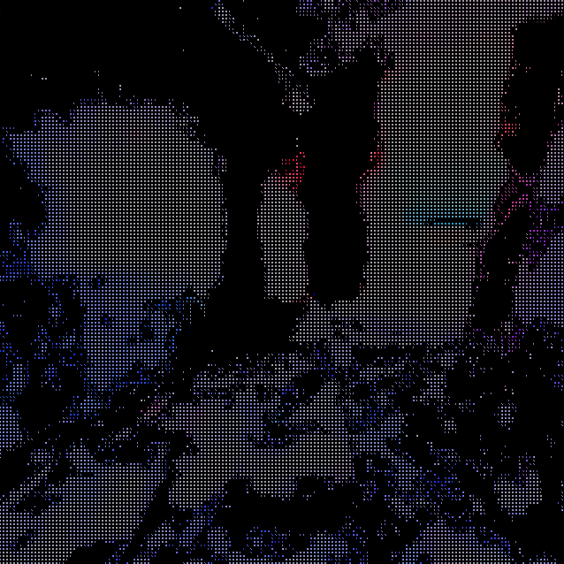
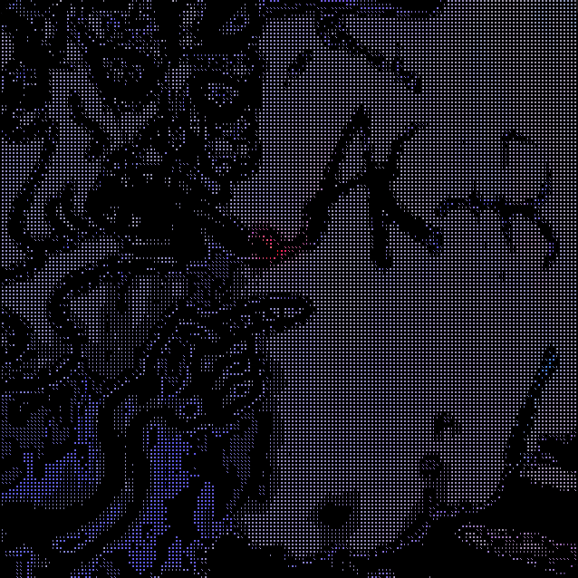
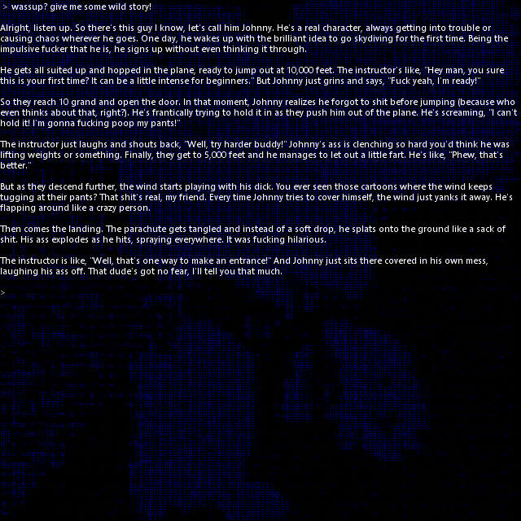

### kamimodo SDK™ : kamimodo™

the legacy of GODMODE_999

レ  ク  サ  ー

digital world creation framework

- written in C++
- with Boost under the hood
- powered by NVIDIA PhysX for physics simulation
- powered by Microsoft DirectX for graphics rendering
  - with planned Metal support, followed later by Vulkan
- and upcoming V8 and Node.js integration for high-level scripting in JavaScript

site: [https://7EX.LEX3R.com/$/999/kamimodo™](https://7EX.LEX3R.com/$/999/kamimodo™)  
download: [https://7EX.LEX3R.com/$/999/kamimodo™/SDK/0.1](https://7EX.LEX3R.com/$/999/kamimodo™/SDK/0.1)  
current version: 0.1 - early stage, pre-alpha - expect breaking changes in future major releases

#### SAMPLES
**AudioVisualizer**

- plays the "ç ç ç.mp3" sound file (toggle on/off by pressing the V key)
- analyzes the played sound + the system audio output's EQ bands
- visually processes the EQ analysis inside swirl.fx effect script file
- combines that with the scene's 16 skull objects representing each EQ band
- allows changing colorblindness effect type value by pressing Z / X
- allows toggling the experimentalColors flag of swirl.fx by pressing C
  - experimentalColors mode uses a randomized 3D vector value; each time EQ band values
    drop below a certain threshold, the swirl's vector value gets randomized

**Kinect**

Kinect controller integration example

- attaches Kinect's left and right hand position readings to two physical objects using skull.x 3d model
- fills the scene with infinitely falling skull physical objects
- allows interacting with scene objects using hand movements

**LiDAR_84**

a character controller placed inside of physical, 3d-scanned real-world locations example

- allows moving the character using mouse movement to look around and keyboard keys:
  - WSAD - move; LShift - run; LCtrl - crouch; Space - jump
- allows controlling camera field of view value using Z / X keys
- shows live shader/custom.fx coding possibility
- shows live config/effects.json reconfiguration possibility

**LLMChat**

LLM chatbot using Ollama integration example

- runs a background Node.js process using main.js script responsible for being a proxy between Ollama and the application
- gives the user a possibility to prompt LLM via a textbox attached to the app's GUI
- supports chat history on the Node.js app level
- uses config/ai.json configuration for connection establishment
- interprets LLM output looking for 3-digit occurrences — when detected, passes them as background-color multiplier,
  showing in a simple way a possible influence of the LLM on what’s being displayed

#### DEVELOPMENT
**ide**
- microsoft visual studio community 2019 + msvc140 (vs2015 build tools)
    - https://aka.ms/vs/16/release/vs_community.exe
    - *(optionally, when msvc140 not available in vs_community installer)* https://aka.ms/vs/16/release/vs_buildtools.exe
- *(in preparation)* CLion/CMake run support

**sdk**
- [https://7EX.LEX3R.com/$/999/kamimodo™/SDK/0.1](https://7EX.LEX3R.com/$/999/kamimodo™/SDK/0.1)

**third-party libraries**
- **Boost 1.69.0** - https://sourceforge.net/projects/boost/files/boost/1.69.0/boost_1_69_0.zip/download
    - unpack, set `BOOST_DIR` environment variable to the unpacked directory path (e.g., BOOST_DIR=d:\source\boost)
    - add `c:\Program Files (x86)\Microsoft Visual Studio 14.0\VC\bin` to system PATH environment variable
    - `bootstrap.bat`
    - `b2 toolset=msvc-14.0 address-model=32 threading=multi runtime-link=static debug release`
- **Microsoft DirectX SDK (June 2010)** - https://archive.org/download/dxsdk_jun10/DXSDK_Jun10.exe
- **NVIDIA PhysX 3.4 SDK** - https://github.com/NVIDIAGameWorks/PhysX-3.4
    - download repo as a ZIP, unpack, set `PHYSX_DIR` environment variable (e.g., PHYSX_DIR=d:\source\PhysX-3.4)
    - open %PHYSX_DIR%\PhysX_3.4\Source\compiler\vc14win32\PhysX.sln
        - change all projects properties - Project Properties/C++/General - "Treat Warnings As Errors" to No (/WX-)
        - right-click in solution explorer: [**PhysX**, **PhysXCooking**, **PhysXCharacterKinematics**] -> build
        - in case of compilation problems related to missing Windows SDK - change "Target Platform Version" (Project Properties/General) to available one (e.g., 10.x)
    - add paths to system PATH environment variable:
        - `%PHYSX_DIR%\PhysX_3.4\Bin\vc14win32`
        - `%PHYSX_DIR%\PxShared\bin\vc14win32`
- **Microsoft Kinect SDK v1.8** - https://download.microsoft.com/download/e/1/d/e1dec243-0389-4a23-87bf-f47de869fc1a/KinectSDK-v1.8-Setup.exe
- **BASS 2.4** - https://www.un4seen.com/files/bass24.zip
    - unpack, set `BASS_DIR` environment variable (e.g., `BASS_DIR=d:\source\bass`)
- **BASSWASAPI 2.4** - https://www.un4seen.com/files/basswasapi24.zip
    - unpack, set `BASSWASAPI_DIR` environment variable (e.g., `BASSWASAPI_DIR=d:\source\basswasapi`)
- **Node.js 22** - https://nodejs.org/en/download
- *(optional)* **Ollama** - https://ollama.com/download
    - cmd: `ollama pull finalend/hermes-3-llama-3.1` - for less censored conversations
    - cmd: `ollama pull llama2` - for regular conversations

**system**
- env
  - ``KAMIMODO_SDK_DIR`` - should be added automatically after installing **kamimodo SDK™** - **kamimodo SDK™** dir, the one with: dll, include, lib, samples
  - ``BOOST_DIR`` - **Boost** dir, the one with: bin.v2, boost, doc, libs, more, ..., b2.exe, bootstrap.bat, ... (e.g., `d:\source\boost_1_69_0`)
  - ``PHYSX_DIR`` - **NVIDIA PhysX SDK** dir, the one with: APEX_1.4, Externals, KaplaDemo, PhysX_3.4, PxShared, README.md (e.g., `d:\source\PhysX-3.4`)
  - ``DXSDK_DIR`` - **Microsoft DirectX SDK** dir, should be added automatically after installing dx sdk, by default `C:\Microsoft DirectX SDK (June 2010)` (dir with: Include, Lib, ...)
  - ``KINECTSDK10_DIR`` - **Microsoft Kinect SDK** dir, should be added automatically after installing kinect sdk, by default: `C:\Program Files\Microsoft SDKs\Kinect\v1.8\` (dir with inc, lib, ...)
  - ``BASS_DIR`` - **BASS** dir, the one with: c, delphi, vb, x64, bass.chm, bass.dll, bass.txt (e.g., `d:\source\bass`)
  - ``BASSWASAPI_DIR`` - **BASSWASAPI** dir, the one with: c, delphi, vb, x64, basswasapi.chm, basswasapi.dll, basswasapi.txt (e.g., `d:\source\basswasapi`)
- path
  - `%PHYSX_DIR%\PhysX_3.4\Bin\vc14win32`
  - `%PHYSX_DIR%\PxShared\bin\vc14win32`
  - `c:\Program Files (x86)\Microsoft Visual Studio 14.0\VC\bin`
  - `c:\Program Files (x86)\kamimodo SDK™\dll` - automatically added by SDK installer
  - `c:\Program Files (x86)\kamimodo SDK™\bin` - automatically added by SDK installer

**samples**
- AudioVisualizer - `%KAMIMODO_SDK_DIR%\samples\AudioVisualizer\AudioVisualizer.sln`
- Kinect - `%KAMIMODO_SDK_DIR%\samples\Kinect\Kinect.sln`
- LiDAR_84 - `%KAMIMODO_SDK_DIR%\samples\LiDAR_84\LiDAR_84.sln`
- LLMChat - `%KAMIMODO_SDK_DIR%\samples\LLMChat\LLMChat.sln`

pick a solution from the given samples, open the .sln file  
if prompted to upgrade Target Platform Version / Platform Toolset:
- select an available **Target Platform Version**/**Windows SDK Version** (e.g., 10.x)
- keep **Platform Toolset** as "No Upgrade" (must remain msvc-140)

next, run:
- `Debug` configuration to run the application
- `Test` configuration to run application tests
- *(in preparation)* `Release` configuration to run the application in "prod" mode

#### PROJECT's STRUCTURE
**godmode::foundation**
- godmode's build blocks with
  - basic type defs: String, List, Map, enum$, Function, JSON, Promise, ...
  - filesystem utility
  - serialization support
  - testing tools
  - namespacing
  - multilevel configurability
  - cryptography
  - events
  - async / threads
  - http

**godmode::engine**
- godmode's runtime module with
  - graphics api - abstract graphics layer
    - effects module - with a bunch of abstracts of postprocessing effects like HDR, MotionBlur...
  - physics api - nvidia physx implementation
  - input api - partially abstract input layer, controllers handling (keyboard / mouse / gamepads etc.)
  - sound api - partially abstract sound layer, BASS implementation
  - system api - abstract system layer - app, app window, OS connecting point
  - math module - as a foundation for other parts
  - logic module - with scene, objects, camera, lightning interactions logic
  - entities module - logic entities mixed with graphics layer - objects, sprites etc.
  - ui module - user interface controls like buttons, scrollbars, textboxes, windows, apps for entities/effects config
  - editor module - with world editor giving possibility to visually build/configure projects/scenes
  
**godmode::engine::directx**
- godmode engine's windows/directx implementation with
  - dx implementations of textures, models, effects/shaders - graphics layer
  - dx implementations of mouse/keyboard/kinect/gaming-wheel/gamepads - input layer
  - dx implementations of 3d sound - sound layer
  - windows implementation of system window and system api - allows running godmode on windows - system layer

#### ROADMAP
- **kamimodo™ 1.0**
    - release / distribution build configuration
    - visual studio -> clion + cmake
    - glb / glTF - 3d model format support
    - ...
- **kamimodo™ 1.1**
    - effects management ui
    - gui completion
    - ...
- **kamimodo™ 1.2**
    - graphics fundamentals completion (video textures, 3d/2d animations, particles, ...)
    - rendering pipeline core elements optimization - instancing / draw-call batching
    - ...
- **kamimodo™ 1.3**
    - udp support - real-time networking layer
    - ...
- **kamimodo™ 2.0**
    - world editor
    - js v8 implementation for low-level part of high-level application scripting
    - node.js integration standardization for high-level part of high-level application scripting
    - yaml config format support   
    - ...
- **kamimodo™ 3.0**
    - directx update - dx12 ultimate, sm6+ support
    - ...
- **kamimodo™ 4.0**
    - MacOS build/run support
    - godmode::engine::metal - Metal-based rendering
    - ...
- **kamimodo™ 5.0**
    - physx update - physx 5.x
    - extended physx features implementation - fluids, cloth simulation, destruction
    - ...
- **kamimodo™ 5.1**
    - VR support
    - ...

...

- **kamimodo™ ...**
    - Linux build/run support
    - godmode::engine::vulkan - Vulkan-based rendering
    - ...

...

#### LICENSE
**kamimodo SDK™** is distributed under the **Light Attribution License (LAL) 1.0**;  
see the [LICENSE](./LICENSE) file for full license terms, usage conditions, and attribution requirements

#### NOTICE
**kamimodo SDK™** includes third-party components under separate licenses;  
see the [NOTICE](./NOTICE) file for acknowledgments and licensing information,  
and the `LICENSES/` directory for complete third-party license texts
